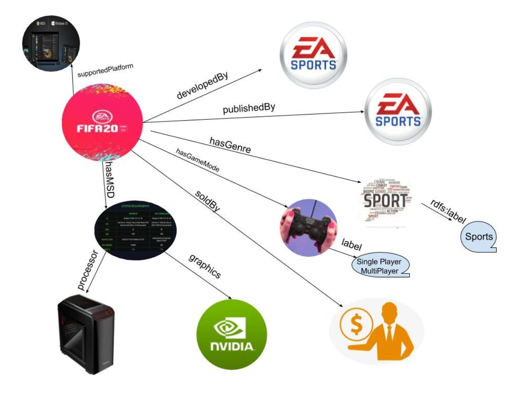
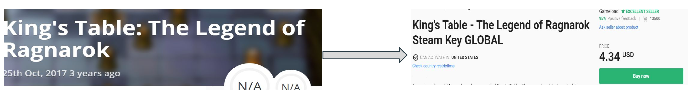
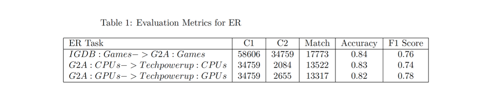
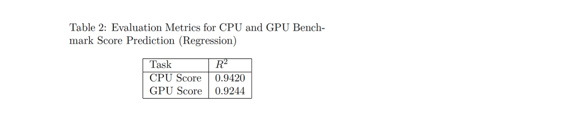
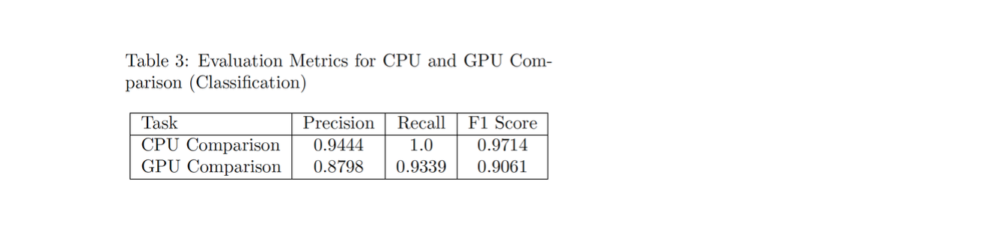
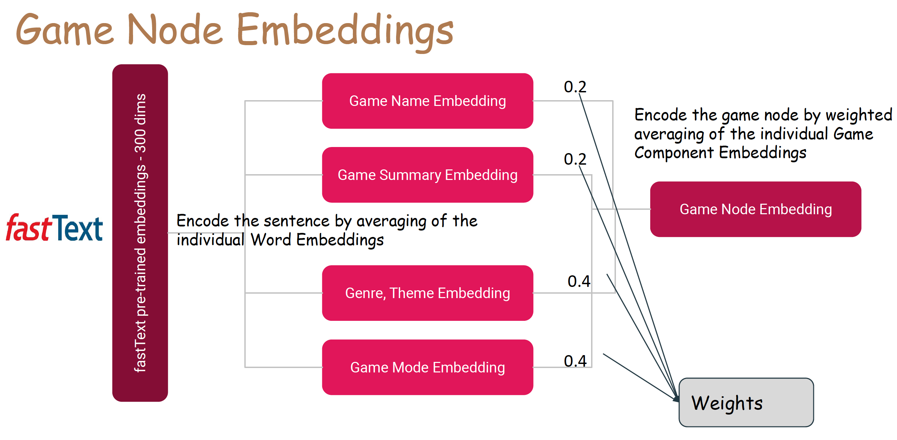
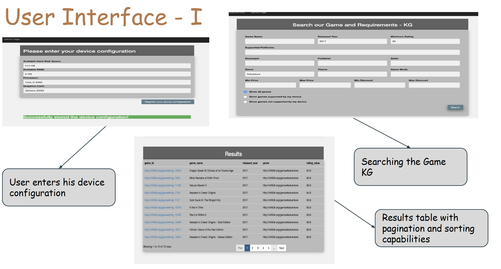
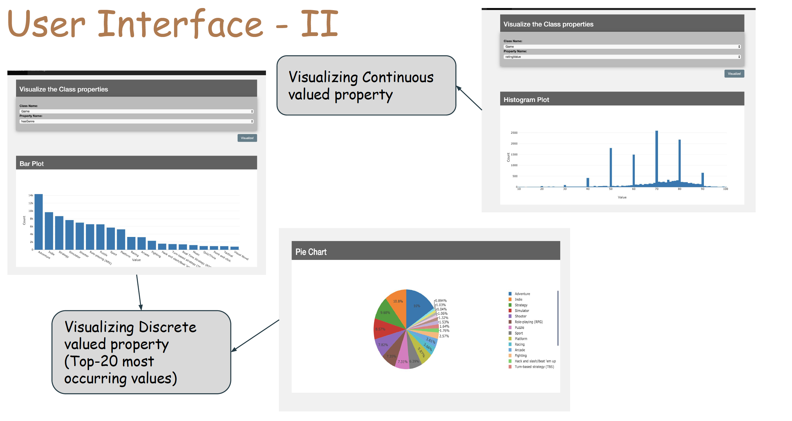
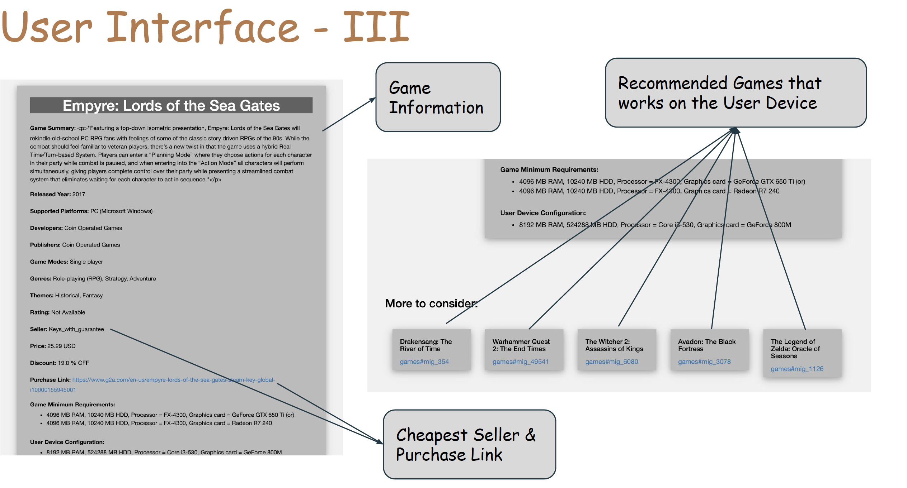

# Game-and-Requirements-KG
Building a Knowledge Graph about Games, Requirements and Purchase source! 

## Project Submissions

**Project Demo**: The youtube video about our project demo can be found here: [https://www.youtube.com/watch?v=wa_C4xqBmjo](https://www.youtube.com/watch?v=wa_C4xqBmjo)  
**Project Presentation Slides**: The project presentation slides can be found here: [Slides](submissions/rselvam_rvohra_INF558_final_project_presentation.pdf)  
**Project Report**: The project report can be found here: [Report](submissions/rselvam_rvohra_INF558_final_project_report.pdf)  

## Modules

The Games Knowledge Graph that we build looks something like this:

### 1. Crawling

We crawled different types of information from multiple data sources as listed below,
​

- Games information was crawled from [IGDB.com](https://www.igdb.com/discover)
- Information about the system specifications required to play a particular game, the cheapest purchase source was crawled from [G2A.com](https://www.g2a.com)
- The details about all the CPU's and GPU's was crawled from [Techpowerup.com](https://www.techpowerup.com)
- The baseline information about the performance scores for the CPU and GPU was crawled from [Passmark.com](https://www.passmark.com)

The code for all these crawling tasks can be found [here](https://github.com/ravikiran0606/Game-and-Requirements-KG/tree/master/1_crawling/crawlers)

### 2. Entity Resolution
We performed multiple entity resolution tasks as listed below,

- The first entity resolution task that we handled was mapping the games crawled from IGDB to the games crawled from G2A. This mapping was necessary to enrich the games with information like the device specifications, cheapest purchase source. Code can be found [here](https://github.com/ravikiran0606/Game-and-Requirements-KG/blob/master/2_entity_resolution/ER_igdb_g2a_rijul.py)
- The second entity linking task that we did was to map the CPU and GPU information from G2A to the CPU, and GPU information crawled from Techpowerup. The entity linking code for the CPU can be found [here](https://github.com/ravikiran0606/Game-and-Requirements-KG/blob/master/2_entity_resolution/ER_g2a_cpu_techpowerup_cpu_v1.py). Code for GPU linking can be found [here](https://github.com/ravikiran0606/Game-and-Requirements-KG/blob/master/2_entity_resolution/ER_g2a_games_gpus_and_techpowerup_gpus.py)
- Code for linking the CPU information from Techpowerup to get the benchmark score from Passmark can be [here](https://github.com/ravikiran0606/Game-and-Requirements-KG/blob/master/2_entity_resolution/ER_techpowerup_cpubenchmark.py). Similar code for the GPU can be found [here](https://github.com/ravikiran0606/Game-and-Requirements-KG/blob/master/2_entity_resolution/ER_benchmark_gpus_and_techpowerup_gpus.py)

### 3. Ontology Mapping

We designed our ontology. We identified seven classes. We inherited some of the classes and properties from schema.org and customized others according to our needs. The entire ontology file can be found [here](https://github.com/ravikiran0606/Game-and-Requirements-KG/blob/master/3_ontology_mapping/Game%20Requirements%20Ontology.pdf)

### 4. CPU and GPU Comparison

Since CPUs and GPUs have many features (both numerical and categorical), it is hard to implement a comparison function manually. 
We found benchmark performance scores for some of the CPUs and GPUs online at [https://www.cpubenchmark.net](https://www.cpubenchmark.net) and [https://www.videocardbenchmark.net](https://www.videocardbenchmark.net), respectively. 
We used this as the ground truth data and trained our Random Forest Regressor model to predict the benchmark score for both CPUs and GPUs.

The most important GPU features that determines the G3D mark score are as follows,
1. Pixel Shader
2. ROPs
3. GPU Clock Speed
4. Memory Clock Speed
5. TMUs

The most important CPU features that determines the CPU mark score are as follows,
1. Process
2. TDP
3. Socket
4. Number of Cores
5. Clock Speed

### 5 & 6. Building & Querying the KG

The code snippet for building the KG can be found [here](5_building_kg/build_KG.py) and example queries we used for querying our KG can be found [here](6_query_triples/sparql_queries.py).

### 7. Evaluation

We evaluated the Entity resolution tasks by manually labelling 100 random samples for each of the tasks and used them to evaluate.
The metrics for the ER tasks are mentioned in Table 1 below,

We evaluated our CPU and GPU comparison models using two types of tasks. The first one is a regression task where we predict the benchmark score for a given CPU (or) GPU, and this is evaluated using the R2 metric. 
The second one is a classification task where we classify the given pair of CPUs (or) GPUs into two classes. 
The first class indicates if the first one is better than or similar to the second one and the second class indicates if the first one is not better than the second one. 
This task is evaluated using the F1 measure.  The results can be found in Table 2 and Table 3 below,

### 8. Node Embeddings

We compute the embeddings for each of the game nodes using the fastText pre-trained embeddings as shown in the below figure, 

1. First, we calculate the embeddings for the game's components like name, description, genre, theme, and game mode. 
2. Then, the game node embedding is created by the weighted average of the individual game components' embeddings. 
The weights were determined heuristically to build a game recommendation system.

## Personalized Game Recommendation System

We build a personalized game recommendation system using the game node embeddings.

For a given source game and a user device, to recommend the top-5 similar games, we follow the steps below,

1. First, we filter only the games with rating >= 80 among all the games (except the source game).
2. We then apply a second filter to retain only the games that the user can play on his device (i.e., the game works on the user device)
3. Finally, we rank those filtered games by the cosine similarity score between their game node embedding and the source game node embedding and display the top-5 recommendations.

## Web Application - User Interface:

We created a Flask web application connected to the Apache Jena Graph database and used SPARQLWrapper for querying. The logical flow of using our system is as follows: 

1. First, the user should enter his device configuration, and the system at the backend would map the processor and graphics to a score, respectively. 
2. Then, the user can search our knowledge base using 14 attributes and can also filter games supported by his system. The Game page displays all the attributes of the game and has a link to the cheapest
seller for that game. It also has links to the Top-5 recommended game pages.
3. The user can also use the visualization page to visualize the various properties of the Game class and other classes using Plotly.js.

The user interface of our web application is shown in the below figures,

